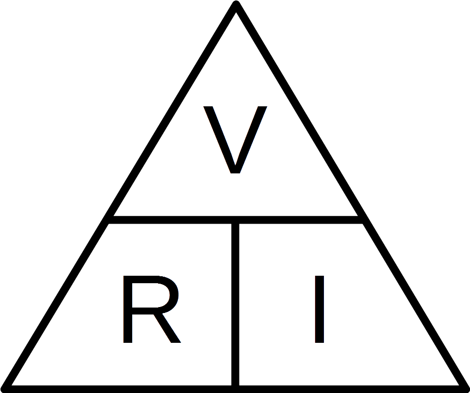

# Análise de Circuitos Elétricos
## Aula 01 - Revisão Conceitual, Elementos de Circuitoss, Lei de Ohm e Potência Elétrica

Prof. M.Sc. Diego Ascânio Santos (ascanio@cefetmg.br)

Aula baseada sobre o material do professor Dr. Emerson Gonçalves de Melo (emerdemelo@usp.br - DEMAR EEL USP)

Divinópolis, 2023.

---

# Essa aula segue o segundo princípio do Zen do Python.

---

Aula 01 - Roteiro

1. Revisão Conceitual
2. Elementos de Circuitoss
3. Lei de Ohm
4. Potência Elétrica
5. Referências Bibliográficas

---

<!-- _class: lead -->
# Revisão Conceitual

---

Revisão Conceitual - Carga Elétrica

- Carga elétrica: propriedade fundamental das partículas (quarks e elétrons) que compõem a matéria (átomos); <!-- Pois, está presente em todos os átomos -->
<!-- No átomo temos prótons (compostos por dois quarks up (2 * 2/3 carga) e um down (-1/3 carga) que equivale a uma carga positiva) -->
<!-- Elétrons que possuem uma carga negativa (e o átomo no seu estado fundamental é neutro, nº protons = nº eletrons) -->
<!-- E por fim, neutrons, que possuem carga neutra (ao terem dois quarks down (-2/3 de carga) e um quark up (2/3 carga) = 0 carga) -->

<!-- Essa propriedade é a base das forças eletromagnéticas e é a causa de fenômenos como eletricidade e magnetismo. Uma das suas características mais importantes é que cargas de sinais iguais se repelem e de sinais diferentes se atraem. -->

- Quando existe diferença entre átomos e elétrons em um corpo, dizemos que este corpo está carregado (ou eletrizado).
- Se não existe diferença, este corpo então encontra-se neutro.
- Unidade de medida da carga elétrica: Coulomb $(C)$

<!-- Um elemento de carga: dois quarks up e um down (a carga do próton) ou a carga de um elétron -->

- Carga elétrica elementar: a carga elétrica (em Coulomb) composta por um elemento $(e)$ de carga.
    - $e = 1.602 \times 10^{-19} C$
    - Carga de um elétron: $-e = 1.602 \times 10^{-19} C$
    - Carga de um próton: $+e = 1.602 \times 10^{-19} C$
- A carga elétrica $Q$ em qualquer corpo é calculada pela fórmula:
    - $Q = ne$
    - $n = \text{nº de eletrons em falta ou excesso} = {{Q} \over {e}}$
    - 1C (Coulomb) equivale à carga de $6.24 \times 10^{18}$ elétrons
        - $n = {Q \over e} = {{1C} \over {1.602 \times 10^{-19}C}} = 6.24 \times 10^{18}$

<!-- Onde n é a diferença de elétrons e prótons de um corpo e $e$ é a carga elétrica elementar -->
<!-- Se um átomo perde elétrons, logo, nº protons > nº elétrons, portanto, sua carga fica positiva -->
<!-- Quando um átomo ganha elétrons, logo, nº protons < nº elétrons, portanto, sua carga fica negativa -->

---

Revisão Conceitual - Lei de Coulomb

- Lei de Coulomb
    - Formulada por Charles-Augustin de Coulomb.
    - Descreve a Força $(\vec{F})$ eletrostática entre duas cargas elétricas $Q_{1}$ e $Q_{2}$.
        - $\vec{F} \propto Q_{1}Q_{2}$ <!-- a força entre duas cargas é diretamente proporcional ao produto das magnitudes das cargas -->
        - $\vec{F} \propto^{-1} {r_{12}}^{2}$ <!-- a força entre duas cargas é inversamente proporcional ao quadrado da distância entre elas -->
    - $\vec{F}$ é uma força de atração se $Q_{1}$, $Q_{2}$ possuem sinais opostos.
    - De repulsão, se $Q_{1}$, $Q_{2}$ possuem sinais iguais.

<!-- _class: lead -->
## Equação

<!-- F_12 equação -->

$$ \vec{F_{12}} = {{Q_{1}Q_{2}} \over {4 \pi \varepsilon_{0} {|r_{12}|}^{2} }} {\hat{r}_{12}} $$ 

<!-- r_12 chapéu é o vetor unitário da distância entre as cargas, que aponta a direção -->

$$ {\hat{r}_{12}} = {\vec{r_{12}} \over {|r_{12}|}} $$

$$ \varepsilon_{0} = 8.85 \times 10^{-12} {C^{2} \over {Nm^{2}}}$$

---

Revisão Conceitual - Campo Elétrico

<!-- Na existência de grandes quantidades de cargas, aplicar a lei de Coulomb para estudar a interação entre elas torna-se matematicamente difícil. -->

- Aplicar lei de Coulomb para estudar interação entre múltiplas cargas é difícil.

<!-- Assim, é melhor entender a influência que uma carga elétrica exerce sobre outras de seu entorno. -->

- Entender a influência que uma carga elétrica exerce sobre outras de seu entorno é mais fácil!

- O campo elétrico descreve esta influência. <!-- Que uma carga exerce sobre demais cargas próximas -->

- Definido pela força elétrica que uma carga positiva de prova sofreria sob a influência da carga original, da forma:
    - $\vec{E} = {\vec{F} \over q_{\text{prova}}}$, onde $q_{\text{prova}}$ representa (em coulombs) a carga de prova.

Qual o campo elétrico exercido pela carga $Q$ sobre a carga $Q_{\text{teste}}$?

$\vec{F}_{QQ_{teste}} = {{QQ_{\text{teste}}} \over {4 \pi \varepsilon_{0} |{r_{QQ_{\text{teste}}}}|^{2}}} \hat{r}_{QQ_{\text{teste}}}$

$\vec{E} = {{\vec{F}_{QQ_{teste}}} \over {Q_{\text{teste}}}} = {{Q} \over {4 \pi \varepsilon_{0} |{r_{QQ_{\text{teste}}}}|^{2}}} \hat{r}_{QQ_{\text{teste}}}$

---

<!-- _class: lead -->
# Exemplo de Cálculo de Campo Elétrico

<!-- _class: lead -->
Duas cargas pontuais de 5 nC e -2 nC estão localizadas, respectivamente, nas coordenadas cartesianas (2, 0, 4) e (-3, 0, 5). Calcule o vetor campo elétrico e a intensidade da força elétrica exercida sobre uma carga de 1 nC localizada em (1, -3, 7).

---

<iframe src="https://diegoascanio.github.io/jupyterlite/lab/?path=campo-eletrico.ipynb" width=100% height=100% ></iframe>
<!--
<iframe src="http://localhost:8888/notebooks/campo-eletrico.ipynb" width=100% height=100% ></iframe>
-->

---

Revisão Conceitual - Trabalho da Força Elétrica

- O trabalho $W$ realizado pela força elétrica ao transportar uma carga $Q^{'}$ em equilíbrio e sob ação de uma outra carga $Q$, de uma posição inicial $r_{i}$ à uma posição final $r_{f}$ é:

$$
\begin{align}
W &= \int_{C}{F \cdot dL} \rightarrow {} \\
W &= \int_{C}{ {{1} \over {4 \pi \varepsilon_{0}}} {{Q^{'}Q} \over {{{|r}|}^{2} }} {\hat{r}} \cdot {dr \hat{r}} } \rightarrow {} \\
W &= {{Q^{'}Q} \over {4 \pi \varepsilon_{0}}} \int_{r_{i}}^{r_{f}} {{1} \over {r^{2}} {dr}} \rightarrow {} W = {-{Q^{'}Q} \over {4 \pi \varepsilon_{0}}} {\left( {{1} \over {r}} \right)}_{r_{i}}^{r_{f}} \\
\end{align}
$$

$$
\begin{align}
W &= {-{Q^{'}Q} \over {4 \pi \varepsilon_{0}}} {\left[ {{1} \over {r_{f}}} -  {{1} \over {r_{i}}} \right]} \\
\end{align}
$$

1. O trabalho independe do caminho percorrido pela carga;
2. Se $r_{f} = r_{i} \rightarrow W = 0$ 
3. A força elétrica é conservativa, portanto, existe uma energia potencial elétrica $\Delta U$ associada à ela.
4. Essa energia potencial elétrica é simétrica (oposta) ao trabalho:
    - $\Delta U = -W$

Assim:

$$
\begin{align}
\Delta U &= {{Q^{'}Q} \over {4 \pi \varepsilon_{0}}} {\left[ {{1} \over {r_{f}}} -  {{1} \over {r_{i}}} \right]} \\
\end{align}
$$

---

Elementos de Circuitos - Tensão

A diferença de potencial elétrico ou Tensão $(V)$ é a quantidade de energia potencial elétrica $\Delta U$ por unidade de carga necessária para transportar uma carga elétrica $Q^{'}$ de um ponto $a$ para um ponto $b$;

$$
\begin{align}
V_{ab} &= {{\Delta U} \over Q^{'}} = {{Q} \over {4 \pi \varepsilon_{0}}} {\left[ {{1} \over {r_{b}}} -  {{1} \over {r_{a}}} \right]} \\
V_{ab} &= V_{b} - V_{a}
\end{align}
$$

A presença de Tensão sinaliza que um sistema possui a habilidade de transportar cargas elétricas, ou seja, tem a capacidade de manter um fluxo de corrente elétrica.

Unidade de medida: 

${J \over C} = {{Nm} \over C} = V (\text{Volt})$

<!-- O polo negativo de uma fonte está negativamente carregado, portanto, contém excesso de elétrons. O positivo, está positivamente carregado, portanto, faltam elétrons. Quando ligamos os polos da fonte em série a um elemento de carga (exemplo, a lampada) os elétrons em excesso do polo negativo se deslocam em direção ao positivo através do circuito, passando pela lâmpada e gerando calor (na lampada incadescente) ao ponto do calor gerado ser tão alto que a lâmpada passa a emitir fótons - Luz -->

---

Elementos de Circuitos - Simbologia de Fontes de Tensão

<!-- Simbologia da fonte variável: v minusculo e circulo (+/-) -->

<!-- Simbologia da fonte fixa: V maiúsculo, linhas horizontais paralelas, maior linha: polo positivo, menor linha: polo negativo -->

<!-- Simbologia da fonte dependente (ou controlada) losango (+/-). A fonte é controlada porque um elemento externo controla a tensão que ela é capaz de disponibilizar, como por exemplo, um amplificador operacional (a ser visto na sessão de quadripolos) -->

---

Elementos de Circuitos - Corrente Elétrica

- A corrente elétrica é o fluxo (transporte) de cargas elétricas através de um condutor.
- Criada quando existe uma diferença de potencial (tensão) entre dois pontos de um condutor, pois, a tensão, como vimos, representa a energia potencial elétrica necessária --- $\Delta U (J)$ --- para TRANSPORTAR uma quantidade $Q^{'}$ de cargas $(C)$.
    - Por $\Delta U$ ser causado pela aplicação de uma força elétrica para mover uma carga $Q^{'}$ de uma posição de origem $r_{i}$ até uma posição final $r_{f}$, logo, essa força elétrica atrai cargas de sinais opostos e repele cargas de sinais iguais.
        - Assim, em uma fonte de tensão conectada a um condutor (e um elemento de carga) ocorre um deslocamento$^{1}$ ordenado$^{2}$ de elétrons do pólo negativo que contém excesso de elétrons --- cargas negativas com o mesmo sinal, que se repelem entre si --- para o pólo positivo que apresenta falta de elétrons, e portanto, uma maior concentração de prótons (sinais positivos) que atrai os elétrons (cargas negativas) oriundos do pólo negativo para si.

${^1}$: Fluxo
${^2}$: Por ser ordenado, é que se chama corrente, como uma corrente! Como algo em cadeia!

    

    <iframe width="100%" src="https://www.youtube.com/embed/_dQJBBklpQQ" title="The Chain Fountain" frameborder="0" allow="accelerometer; autoplay; clipboard-write; encrypted-media; gyroscope; picture-in-picture; web-share" allowfullscreen></iframe>

<!--
- O fluxo de elétrons do polo negativo até o positivo da fonte excita os átomos presentes no filamento da lâmpada. 
- Estes átomos absorvem uma parcela da energia presente neste fluxo e se tornam excitados, com os elétrons mais próximos do núcleo efetuando saltos de camada$^{3}$ para regiões mais afastadas do núcleo.
- O afastamento dura $ms$ e o elétron retorna a sua camada de origem.
- Ao retornar para a camada de origem, precisa gastar a energia que recebeu, liberando esta energia por meio da emissão de luz (através de fótons)

$^{3}$: ver camadas de linus pauling.
-->

---

Elementos de Circuitoss - Corrente Elétrica

- O fluxo de cargas (corrente) só ocorre por que os átomos dos materiais condutores dispõem de muitos elétrons livres - elétrons que tem ligação fraca com o núcleo atômico - que têm tendência para serem doados para outros átomos, então, a passagem de um fluxo de cargas estimula estes elétrons, que movimentam-se para as bandas de outros átomos, também estimulando outros elétrons, criando um processo em cadeia.
  - Este processo em cadeia organiza o fluxo de elétrons (isso é semelhante a uma fila de dominós).

- Pela corrente elétrica ser o fluxo de cargas elétricas através de um condutor, é possível calculá-la por meio de duas formas:
    - Pela razão da variação da carga $(\Delta Q)$ sobre a variação do tempo $(\Delta t)$ em um condutor:
        - $i = {{\Delta Q} \over {\Delta t}}$
    - Pela integração da densidade de cargas $(\rho_{v})$ multiplicada pelo diferencial $u$ da velocidade de deslocamento destas cargas em relação à superfície (normalmente a secção reta) $S$ de um condutor:
        - $i = \int_{S}^{}{\rho_{v} \cdot {u} \cdot {dS} }$
    - Por medir razão de carga sobre tempo, a unidade de corrente é $C \over s$, também conhecida como Ampére $(A)$.

<!--
- Corrente Elétrica: é a razão do fluxo (deslocamento) de cargas elétricas através de um condutor (um fio) pelo tempo em que essa condução acontece. 
    - Ocorre quando existe diferença de potencial (tensão) entre a origem e o fim do fio. Unidade de medida: $A$ (Ampére) ${} = {C \over s}$
- Elétrons livres em um condutor promovem a Corrente de Condução ao serem impulsionados por um campo elétrico ($E$), pois, se existe um campo elétrico, logo, uma força elétrica irá atuar sobre os elétrons livres de um condutor.
    - O cobre é um bom condutor por ter muitos elétrons livres.
    - A condução da corrente elétrica em um condutor ocorre de forma ordenada.
- Como sabemos, um campo elétrico pode ser calculado por: $\vec{E} = {\vec{F} \over Q}$ onde $Q$ representa uma carga de prova qualquer.
-->

<figure>
    
<figcaption>Transferência de Elétrons Livres Entre Átomos</figcaption>
</figure>

---

    Elementos de Circuitos - Exemplos e Diagramas de Fontes de Correntes

    

---

    Elementos de Circuitos - Cálculo da Corrente Elétrica pela Integral de Superfície de Um Condutor

- $i = \int_{S}^{}{\rho_{v} \cdot {u} \cdot {dS} }$
- A integral de superfície é uma generalização das INTEGRAIS MÚLTIPLAS sobre uma superfície. <!-- Sempre temos que considerar os três eixos do espaço, mas a integral de superfície simplifica nossa vida, generalizando uma integral tripla (por exemplo) em uma integral simples -->
- A força $F$ sobre um elétron é:
$$F = -e \cdot E$$
- Um elétron em um condutor submetido a um campo elétrico $E$ passa a se deslocar em uma direção, pela força elétrica $F$ presente em $E$.
- Esse deslocamento provocado por $E$ provê ao elétron uma velocidade $u \text{(m/s)}$ de deslocamento.
- Por se movimentarem com velocidade $u$, elétrons livres em um condutor colidem entre si.
- O intervalo de tempo em que ocorrem duas colisões sucessivas entre elétrons em um condutor é conhecido como tempo de relaxação $\tau$.
- Por meio deste intervalo de tempo é possível calcular a aceleração dos elétrons:
$$ a = {u \over \tau} $$

---

    Elementos de Circuitos - Cálculo da Corrente Elétrica pela Integral de Superfície de Um Condutor

- $i = \int_{S}^{}{\rho_{v} \cdot {u} \cdot {dS} }$
- O elétron dispõe de uma massa $m$ e de aceleração ${u \over \tau}$. Pela Segunda Lei de Newton: 
$$ F = m \cdot a \rightarrow F = m \cdot {{u} \over {\tau}} $$
- Ocorre que a força elétrica em um elétron é definida como $F = -e \cdot E$. Assim,
$$ F = -e \cdot E = m \cdot {{u} \over {\tau}} \rightarrow u = {{-e \tau} \over {m}} E$$
- A diferença de potencial em um condutor linear de comprimento $l$ é dado por: $V = E \cdot l$. Assim, $E = {V \over l}$. Por isso:
$$ u = {{-e \tau} \over {m}} {{V} \over {l}} $$

- $\rho_{v}$ representa a quantidade (densidade) de carga por volume de um sólido (unidade: $C \over {m^3}$). É definido por:

$$
\begin{align}
& \rho_{v} = -n e \\
& \text{onde } n \text{ é quantidade de eletrons por volume de um sólido} \\
& e \text{ é a carga elétrica elementar do elétron } (1.602 * 10^{-19} C) \\
\end{align}
$$

$$
\begin{align}
i &= \int_{S}^{}{\rho_{v} \cdot u \cdot dS} = \int_{S}^{}{{-n e} \cdot {{-e \tau V} \over {m l}} \cdot dS} \rightarrow \\
i &= \int_{S}^{}{{{n e^{2} \tau V} \over {m l}} \cdot dS} \text{ ou } \int_{S}^{}{{{n e^{2} \tau E} \over {m}} \cdot dS} 
\end{align}
$$

No próximo slide veremos o desenvolvimento final do cálculo da corrente pela integral de superfície sobre a da seção reta do condutor.

<!-- considerando que E = V / l -->

---

    Elementos de Circuitos - Cálculo da Corrente Elétrica pela Integral de Superfície de Um Condutor

$$
\begin{align}
i &= \int_{S}^{}{\rho_{v} \cdot u \cdot dS} = \int_{S}^{}{{-n e} \cdot {{-e \tau V} \over {m l}} \cdot dS} \rightarrow \\
i &= \int_{S}^{}{{{n e^{2} \tau V} \over {m l}} \cdot dS} \text{ ou } \int_{S}^{}{{{n e^{2} \tau E} \over {m}} \cdot dS} 
\end{align}
$$ 

$$
\begin{align}
& {{n e^{2} \tau V} \over {m l}} = {{n e^{2} \tau E} \over {m}} = J \\
& i = \int_{S}^{}{J \cdot dS} = J \int_{S}^{}{dS}
\end{align}
$$

<!-- J também é conhecido como densidade de corrente unidade: A/m^2 -->

Como a integral de superfície da seção reta do condutor $\int_{S}^{}{ds}$ é a própria área $A$ da seção reta do condutor, logo:

$$
\begin{align}
i &= J A \rightarrow \\
i &= {{n e^{2} \tau V} \over {m l}} \cdot A = {{n e^{2} \tau E} \over {m}} \cdot A
\end{align}
$$

J também é conhecido como densidade de corrente elétrica, tendo por unidade $({{C} \over {s m^{2}}})$ ou $({A \over m^2 })$

<figure>
    

    <figcaption>Condutor Linear com Sua Área \(A\) de Seção Reta Perpendicular a si.</figcaption>
</figure>

---

    Elementos de Circuitos - Cálculo da Corrente Elétrica

- Verificamos assim, duas formas de se calcular corrente elétrica:
    1. Corrente elétrica em função da razão da variação da carga pela variação do tempo:
    $$
    i = {\Delta Q \over \Delta t} = {dQ \over dt}
    $$
    2. Corrente elétrica pela integral de superfície da densidade de corrente $J$ em relação a superfície do condutor:
    $$
    \begin{align}
    & i = \int_{S}^{}{J \cdot dS} = J \int_{S}^{}{dS} \\
    & J = {{n e^{2} \tau V} \over {m l}} = {{n e^{2} \tau E} \over {m}} \rightarrow \\
    & i = J \cdot A \text{, onde } A \text{ é a área da seção reta de um condutor linear.}
    \end{align}
    $$

---

# Porque desenvolvemos a integral da segunda forma? Considerando sua dificuldade e a suficiência do primeiro método para calcular corrente?

---

    Elementos de Circuitos - Constantes de Condutividade e Resistividade Elétrica

- Porque pelo desenvolvimento da integral, ao avaliar as grandezas envolvidas da densidade de cargas e da velocidade de deslocamento delas, extraimos valores constantes comuns ($e$ - carga elementar do elétron; $m$ - massa do elétron) e específicos (para cada elemento — $\tau$ - tempo de relaxação, $n$ densidade de elétrons) que perimitem computar a condutividade elétrica (a facilidade encontrada pelos elétrons para se moverem através do condutor) e a resistividade elétrica (a dificuldade que os elétrons apresentam para se movimentar — inversa à condutividade).

- Esta constante de condutividade — representada pelo símbolo $\sigma$ — está presente na densidade de corrente $J$ valendo ${J \over E} \rightarrow {{n e^{2} \tau} \over {m}}$.

---

    Elementos de Circuitos - Constantes de Condutividade e Resistividade Elétrica

- Constante de condutividade elétrica
    - Representada pelo símbolo $\sigma$
$$\sigma = {{n e^{2} \tau} \over {m}}$$

- Constante de resistividade elétrica
    - Representada pelo símbolo $\rho$
$$\rho = \sigma^{-1} = {{m} \over {{n e^{2} \tau}}}$$

- Por fim, à partir destas constantes é possível deduzir a resistência elétrica como $\rho {l \over A}$ (2ª lei de Ohm) como veremos no próximo slide.

---

    Elementos de Circuitos - Dedução da Resistência Elétrica

Considerando que $i = J \cdot A$, $A$ a seção reta de um condutor linear e $J = {{n e^{2} \tau V} \over {m l}}$:

$$
\begin{align}
i = {{n e^{2} \tau} \over {m}} {{A} \over {l}} V
\end{align}
$$

Aplicando manipulações algébricas:

$$
{{m} \over {n e^{2} \tau}} {{l} \over {A}} i = V
$$

Como ${{m} \over {n e^{2} \tau}} = \sigma^{-1} = \rho$, logo:

$$
\begin{align}
{\rho} {{l} \over {A}} i = V \rightarrow \\
{\rho} {{l} \over {A}} = {V \over i}
\end{align}
$$

Pela lei de Ohm, ${V \over i} = R$. Logo:

$$
{\rho} {{l} \over {A}} = R = {V \over i}
$$

---

    Elementos de Circuitos - Definição da Resistência Elétrica

A Resistência Elétrica $(R)$ é a propriedade caracterizada pela oposição ao fluxo de cargas elétricas através do material;

Pela segunda lei de Ohm: $R = \rho {l \over A}$

Unidade de medida da Resistência: $\Omega$ (Ohm) ${} = {{Js} \over {C^{2}}}$

| Material  | $\rho$ ($\ohm m$)     | Característica |
| --------- | --------------------- | -------------- |
| Prata     | $1,64 \times 10^{-8}$ | Condutor       |
| Cobre     | $1,72 \times 10^{-8}$ | Condutor       |
| Alumínio  | $2,8 \times 10^{-8}$  | Condutor       |
| Ouro      | $2.45 \times 10^{-8}$ | Condutor       |
| Germânio  | $47 \times 10^{-2}$   | Semicondutor   |
| Silício   | $6,4 \times 10^2$     | Semicondutor   |
| Papel     | $10^{10}$             | Isolante       |
| Mica      | $5 \times 10^{11}$    | Isolante       |
| Vidro     | $10^{12}$             | Isolante       |

---

    Elementos de Circuitos - Condutância Elétrica

- Condutância elétrica $(G)$: inverso da resistência elétrica.

$$ G = {1 \over R}$$

Unidade de medida: Siemens ($S$ ou  $\Omega$  Mho)

---

    Elementos de Circuitos - Exemplos e Diagramas de Resistores

- Resistor: elemento que existe para adicionar resistência elétrica em um circuito elétrico;

---

Elementos de Circuitos - Considerações sobre a constante de Resistividade $\rho$

$\rho$ é dependente da temperatura. Quanto maior a temperatura do resistor, maior sua resistividade e cresce linearmente.

$$
\begin{align}
    \rho &= \rho_{0} [1 + \alpha (T - T_{0})] \\
    R    &= \rho_{0} [1 + \alpha (T - T_{0})] {l \over A} \\
\end{align}
$$

Quando $T = T_{0}$, logo, $R_{0} = \rho_{0} {l \over A}$

Assim:

$$
    \begin{align}
        R = R_{0} [1 + \alpha(T - T_{0})]
    \end{align}
$$

$\rho$ - resistividade na temperatura $T$ ($\Omega m$)
$\rho_{0}$ - resistividade na temperatura $T_{0}$ ($\Omega m$)
$\alpha$ - coeficiente de temperatura ($°C^{-1}$)
$T_{0}$ - temperatura de referência ($0$ ou $20°C$)
$T$ - temperatura de operação
$R$ - resistência na temperatura $T$ ($\Omega$)
$R_{0}$ - resistência na temperatura $T_{0}$ ($\Omega$)

**Coeficientes de temperatura de alguns materiais**

| Material | $\alpha(°C^{-1})$ |
|----------|-------------------|
|  Prata   |      0,0038       |
|  Cobre   |      0,0039       |
| Alumínio |      0,0043       |
|  Ouro    |      0,0034       |

---

<!-- _class: lead -->
# Apresentados os conceitos básicos sobre Tensão, Resistência e Corrente, é apresentada a lei de Ohm, uma sistematização simplificada das relações (já apresentadas) entre estas três grandezas.

---

Lei de Ohm

- Da definição de $J$ é obtida a lei de Ohm

Parâmetros distribuídos:

$$
J = \sigma E \rightarrow E = {J \over \sigma} \text{ ou } E = \rho J
$$

Parâmetros concentrados:

$$
I = GV \rightarrow V = {I \over G} \text{ ou } V = RI
$$

Lei de Ohm:

$$
V = RI \text{ ou } I = {V \over R} \text{ ou } R = {V \over I}
$$

    

        
    

---

Lei de Ohm

- Estabelece a relação entre $V$, $I$ e $R$

    

---

Lei de Ohm

- Estabelece a relação entre $V$, $I$ e $R$

    

---

Potência Elétrica

- Potência Elétrica (P): Trabalho (W) por unidade de tempo (t)
    - Unidade de medida: Watt (W) $\rightarrow$ (J/s)

$$
P = {{dW} \over {dt}} = {{dW} \over {dq}} {{dq} \over {dt}} = VI
$$

$$
P = VI
$$

$$
P = RI^{2}
$$

$$
P = {{V^{2}} \over {R}}
$$

$$
\begin{align}
P &= VI \\
P &= 12 V \times 4 A \\
P &= 48W
\end{align}
$$

---

Exercícios (Entregar em 15/08/2023)

1. O decaimento da carga $q$ em um circuito elétrico é definido por: $q(t) = 50 e^{-300t} \mu C$. Determine o valor da corrente elétrica $i$ nos instantes: $t = 0s, t= 10ms \text{ e } t = \infty$
2. A corrente em um circuito elétrico é dada pela equação $i(t) = 10(1 - e^{-2t})A$. Qual a carga que flui através do circuito durante 250 ms?
3. Um fio de cobre possui 1 mm de diâmetro e 900 m de comprimento. Sua resistividade e coeficiente de temperatura à 20℃  são de $1.72 \times 10^{-8} \Omega m$ e 0.00393 $°C^{-1}$, respectivamente. Calcule sua resistência ($R_{60}$) à 60°C.
4. Calcule a corrente e a potência elétrica dissipada por um resistor de $470 \Omega$ submetido a uma diferença de potencial de $12V$?
5. Qual a corrente que circula por um aquecedor elétrico de $6800W$ quando ligado em $127V$?

---

Gabarito da Lista

1. Respostas
    - $i(0) = -15nA$
    - $i(0.01) = -0.7468nA$
    - $i(\infty) = 0$
2. $q (250 \times 10^{-3}) = 0.5326 C$
3. $R_{60} = 22.82 \Omega$
4. $I = 25.5 mA; P = 306.4 mW$
5. $I = 53.5 A$

---

Referências Bibliográficas

- J. W. Nilsson, e S. A. Riedel, “Electric Circuits”, 9 ed., New York, Prentice Hall (2011).
- W. H. Hyat, J. E. Kemmerly, e S. M Durbin, “Análise de Circuitos em Engenharia”, 7 ed., São Paulo, McGraw-Hill (2008).
- C. K. Alexander, e M. N. O. Sadiku, “Fundamentos de Circuitos Elétricos”, 5 ed., Porto Alegre, AMGH (2013).

